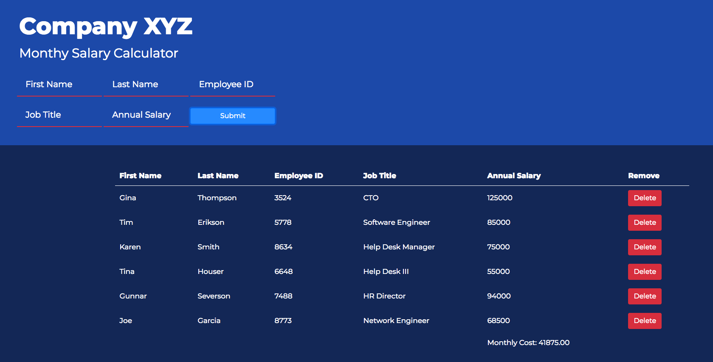

# Weekend 1 Challenge
## Employee Salary Calculator
A salary calculator keeps track of employee records and reports monthly salary costs.

Can hold basic employee information, such as:

- First and Last name
- Employee ID
- Job Title
- Annual Salary

Employee records can be deleted and monthly salary costs are updated when records are added or removed.

Application can be tested [here](https://philip-owen.github.io/Weekend1_Salary_Calc/)

## Built using:
- HTML
- CSS/Bootstrap
- JavaScript
- jQuery

## What's Next?
- [ ] Migrate project to Node.js/Express.
- [ ] Move employee records to PostgreSQL database
- [ ] Convert client side logic from jQuery to AngularJS